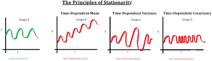

class: middle, inverse, center
#Revisão das aulas anteriores

---
class: middle
##Pressuposições

- Vamos assumir que o processo  $\left\{ Z_t, t \in \mathcal{Z} \right\}$ seja estacionário de segunda ordem, ou seja.

    - $E[Z_t] = \mu$; (média constante)
    - $E[Z^2_t] < \infty, \phantom{11} \forall t$; 
    - $Cov[Z_{t}, Z_{s}]$ é uma função de $|t - s|$.

- Em palavras, a média é constante e a variância é finita ao longo do tempo.  Ainda a função de autocovariância, e consequentemente a função de autocorrelação, é função do "lag".  

- Note que a definição 3, implica que a variância seja constante ao longo do tempo. Pois $Var[Z_t] = Cov[Z_{t}, Z_{t}] = \gamma_0 = \mbox{constante}.$

- Uma definição bem informal de estacionariedade pode ser vista nesse [website](https://www.itl.nist.gov/div898/handbook/pmc/section4/pmc442.htm)

- "we mean a flat looking series, without trend, constant variance over time, a constant autocorrelation structure over time and no periodic fluctuations (seasonality)."
   
---
##Pressuposições - Gráfico das Séries
   
  


####a) Estacionário; b)Não Estacionário (Tendência); c)Não Estacionário (Variância Não Constante); d)Não Estacionário (Correlação Não Constante para o mesmo "lag")

  
###[Fonte]:(https://www.analyticsvidhya.com/blog/2018/09/non-stationary-time-series-python/)   
---
####Revisão  - Função de autocorrelação 


```{r, warning=FALSE, message=FALSE, echo = FALSE}

AR.sm <- list(order = c(1, 0, 0), ar = 0.9, sd = 0.1)
x= arima.sim(n = 50, model = AR.sm)

#Use função acf do R
acf(x, type="correlation")


```

-As abcissas são os "lags", logo, está se assumindo que $Cov(Z_1, Z_2) = Cov(Z_2, Z_3) = \ldots = Cov(Z_t, Z_{t-1}) = \gamma_1$.

---
class: middle, inverse, center
##Modelos auto-regressivos

---
class: middle
##Modelos auto-regressivos

- Um modelo auto-regressivo de ordem $p$, é definido por meio de:

$$\tilde{Z}_t  = \phi_1 \tilde{Z}_{t-1} + \phi_2 \tilde{Z}_{t-2} + \ldots + \phi_p \tilde{Z}_{t-p} + a_t,$$
renomeando os pesos de $\pi_j$ para $\phi_j$, de acordo com a notação usual.

- Se definirmos o operador auto-regressivo estacionário de ordem $p$

$$\phi(B) = 1 - \phi_1 B - \phi_2 B^2 - \ldots - \phi_p B^p,$$
então pode-se escrever 

$$\phi(B) \tilde{Z}_t = a_t.$$
---
class: middle
##Exemplo 1 - Modelo AR(1) (Morettin e Toloi, 2004) 

- O modelo autoregressivo de ordem $p=1$ é dado por:

$$\tilde{Z}_t = \phi \tilde{Z}_{t-1} + a_t,$$
de maneira que $Z_t$ depende apenas de $Z_{t-1}$ e do ruído no instante $t$.

- Agora observe

\begin{align}
\tilde{Z}_t =& \phi \tilde{Z}_{t-1} + a_t \\
\tilde{Z}_{t-1} =& \phi\tilde{Z}_{t-2} + a_{t-1}  \\
\tilde{Z}_{t-2} =& \phi\tilde{Z}_{t-3} + a_{t-2} \\
\ldots
\end{align}


---
class: middle
##Exemplo 1 - Modelo AR(1) (Morettin e Toloi, 2004) 


Assim, por meio de substituições sucessivas tem-se

$$\tilde{Z}_t = a_t + \phi a_{t-1} + \phi^2 a_{t-2} + \ldots = 
\sum_{j=0}^{\infty} \phi^j a_{t-j}.$$

- No entanto, para que o modelo auto-regressivo possa ser escrito dessa maneira, a série $\sum_{j=0}^{\infty} \phi^j$ deve convergir, e, portanto,  $|\phi| < 1.$

- Como vimos na aula passada, a condição $|\phi| < 1.$ assegura que o modelo $AR(1)$, seja estacionário.


---
class: middle
###Condições de Estacionariedade AR(1)

- O modelo $AR(1)$ é estacionário se e somente se as raízes do polinômio $\phi(B) = 1 - \phi B,$ esteja fora do círculo unitário. 

- Observe que $1 - \phi B = 0 \Rightarrow B = \phi^{-1}.$ Assim, para $|\phi| < 1$, tem-se que $|B| > 1.$


###Condições de Invertibilidade para um modelo AR(p)

- Como $\sum_{j=1}^{\infty}|\pi_j| = \sum_{j=1}^p |\phi_j| < \infty,$ o processo é sempre invertível. Ou seja, Uma vez que a soma do processo auto-regressivo é finita, o processo é sempre invertível.

---
class: middle
###Condições de Estacionariedade para um modelo AR(p)

Sejam $R_i^{-1},$ $i = 1, \ldots, p,$ as raízes da equação característica $\phi(B) = 0;$ então podemos escrever

$$\phi(B) = (1 - R_1 B) (1 - R_2 B) \ldots (1 - R_p B).$$

Lembrando da aula passada a relação $\psi(B) = \phi^{-1}(B),$ temos:

$$\psi(B) = \phi^{-1}(B) = \frac{1}{\prod_{i=1}^p (1 - R_iB)},$$
expandido em frações parciais de uma forma similar feita em [EDO](http://www.uel.br/projetos/matessencial/superior/edo/fracparc.htm), temos

$$\psi(B) = \phi^{-1}(B) = \sum_{i=1}^p \frac{A_i}{1 - R_i B}.$$

- Se $\psi(B)$ deve convergir para $|B| \leq 1$ devemos ter que $R_i < 1$, $i =  1, \ldots, p.$

- Esta condição é equivalente a que a equação característica $\phi(B) = 0$ tenha raízes fora do círculo unitário.

---
class: middle
##Função de autocorrelação

- Considere o seguinte modelo auto-regressivo

$$\tilde{Z}_t = \phi_1 \tilde{Z}_{t-1} + \phi_2 \tilde{Z}_{t-2} + \ldots + \phi_p \tilde{Z}_{t-p} + a_t$$

- Multiplicando ambos os lados por $Z_{t-j}$ e tomando a esperança temos

\begin{align}
E[\tilde{Z}_t, \tilde{Z}_{t-j}] =& \phi_1 E[\tilde{Z}_{t-1}, \tilde{Z}_{t-j}] + \phi_2 E[\tilde{Z}_{t-2}, \tilde{Z}_{t-j}] +
\ldots + \phi_p E[\tilde{Z}_{t-p}, \tilde{Z}_{t-j}] \\
\gamma_j =& \phi_1 \gamma_{j-1} + \phi_2 \gamma_{j-2} +
\ldots + \phi_p \gamma_{j-p} \\
\end{align}

Dividindo por $\gamma_0 = Var(Z_t),$ temos:

\begin{align}
\rho_j =& \phi_1 \rho_{j-1} + \phi_2 \rho_{j-2} + \ldots +  \phi_p \rho_{j-p}, \phantom{111} j > 0 \\
\phi(B)\rho_j =& 0.
\end{align}


---
class: middle
##Função de autocorrelação


- Se $\phi(B) = \prod_{i=1}^p (1 - R_i B)$, pode-se demonstrar que 

$$\rho_j = A_1 R_1^j + A_2 R_2^j + \ldots + A_p R^j_p.$$

- Como $|R_i| < 1,$ duas situações podem ocorrer: 

a.  Se $R_i$ for real, o termo $A_iR_i^j$ decai geometricamente para zero (amortecimento exponencial)

b.  Um par de raízes complexas conjugadas contribui com um termo da forma $Ad^jsen(2 \pi f j + \phi)$ (senoide amortecida).

---
class: middle
##Equações de Yule-Walker

- Considerando a seguinte expressão:

$$\rho_j = \phi_1 \rho_{j-1} + \phi_2 \rho_{j-2} + \ldots +  \phi_p \rho_{j-p}, \phantom{111} j > 0$$

- Se fizermos $j = 1, 2, \ldots, p$ teremos

\begin{align}
\rho_1 =& \phi_1  + \phi_2 \rho_{1} + \ldots +  \phi_p \rho_{p-1} \\
\rho_2 =& \phi_1 \rho_{1} + \phi_2 \rho_{0} + \ldots +  \phi_p \rho_{p-2} \\
\ldots \\
\rho_p =& \phi_p \rho_{p-1} + \phi_{2}\rho_{p-2} + \ldots +  \phi_p \rho_{p-2} 
\end{align}
uma vez que $\gamma_{-j} = \gamma_j$ e $\rho_0 = 1$


---
class: middle
##Equações de Yule-Walker


Em notação matricial,


\begin{eqnarray}
\left[
\begin{array}{cccc}
1          & \rho_1     & \ldots  & \rho_{p - 1}\\
\rho_1     & 1          & \ldots  & \rho_{p - 2}\\
\ldots     & \ldots     & \ldots  & \ldots  \\
\rho_{p-1} & \rho_{p-2} & \ldots  & 1  
\end{array} \right]
\left[
\begin{array}{c}
\phi_1 \\ 
\phi_2 \\
\vdots \\
\phi_p
\end{array} \right]
 = 
\left[
\begin{array}{cc}
\rho_{1} \\
\rho_{2} \\
\vdots \\
\rho_{p}
\end{array} \right]
\end{eqnarray}

- Podemos estimar os coeficientes $\phi_1, \ldots, \phi_p$ do modelo $AR(p)$ substituindo as funções de autocovariâncias $\rho_j$ por estimadores $r_j$.


---
## Exemplo 2 - Modelo AR(2) (Morettin e Toloi, 2004)

- Considere agora o modelo AR(2)

\begin{align}
\tilde{Z}_t =& \phi_1 \tilde{Z}_{t-1} + \phi_2 \tilde{Z}_{t-2} + a_t \\
\tilde{Z}_t - \phi_1 \tilde{Z}_{t-1} - \phi_2 \tilde{Z}_{t-2} = a_t \\
(1 - \phi_1 B - \phi_2 B^2) \tilde{Z}_t =& a_t \\
\phi(B) =& a_t. 
\end{align}

- Como já foi visto, o modelo é estacionário se a equação $\phi(B) = 0$, tenha raízes fora do círculo unitário.

- A equação característica é dada por:

$$1 - \phi_1 B - \phi_2 B^2 = 0.$$

- Multiplicando por $(-1)$, temos:

$$\phi_2 B^2 + \phi_1 B - 1 = 0,$$
cuja solução é dada por:

---
## Exemplo 2 - Modelo AR(2) (Morettin e Toloi, 2004)

$$B_1 = \frac{- \phi_1  + \sqrt{\phi_1^2 + 4 \phi_2} }{2 \phi_2}$$

e

$$B_2 = \frac{- \phi_1  -\sqrt{\phi_1^2 + 4 \phi_2} }{2 \phi_2}.$$

Para analisar a estacionariedade, calculamos o recíproco $\frac{1}{B_1},$
$\frac{1}{B_2}$ e aplicamos a racionalização de denominador:


---
## Exemplo 2 - Modelo AR(2) (Morettin e Toloi, 2004)


\begin{align}
\frac{1}{B_1}=& \frac{ 2 \phi_2 }{  (- \phi_1  + \sqrt{\phi_1^2 + 4 \phi_2})} \\
=& \frac{ 2 \phi_2 }{  (- \phi_1  + \sqrt{\phi_1^2 + 4 \phi_2})} \frac{(-\phi_1 - \sqrt{\phi_1^2 + 4 \phi_2})}{(-\phi_1 - \sqrt{\phi_1^2 + 4 \phi_2})} \\
=& \frac{-2 \phi_2 (\phi_1  + \sqrt{\phi_1^2 + 4 \phi_2})}{\phi_1^2 - \phi_1^2 - 4 \phi_2 } \\
=& \frac{\phi_1 + \sqrt{\phi_1^2 +  4\phi_2}}{2}.
\end{align}

De modo análogo, tem-se 

$$\frac{1}{B_2} = \frac{\phi_1 - \sqrt{\phi_1^2 +  4\phi_2}}{2}.$$
---
class: middle
## Exemplo 2 - Modelo AR(2) (Morettin e Toloi, 2004)


O teorema afirma que o processo é estacionário se as raízes estiverem fora do círculo unitário, então a condição requerida é:

$$|\frac{1}{B_i}| < 1, \phantom{111} \forall i = 1,2.$$
- Vamos analisar $\frac{1}{B_1}.$ considerando uma solução válida no conjunto dos reais.

\begin{align}
-1 < & \frac{\phi_1 + \sqrt{\phi_1^2 +  4\phi_2}}{2} < 1 \\
-2 < & \phi_1 + \sqrt{\phi_1^2 +  4\phi_2} < 2
\end{align}


---
class: middle
## Exemplo 2 - Modelo AR(2) (Morettin e Toloi, 2004)

Considerando apenas o lado direito da expressão temos

\begin{align}
\phi_1 + \sqrt{\phi_1^2 +  4\phi_2 } & <  2 \\
\sqrt{\phi_1^2 +  4\phi_2 } & < 2 - \phi_1 \\
\phi_1^2 +  4\phi_2  & < (2 - \phi_1)^2 \\
\phi_1^2 +  4\phi_2  & < 4 - 4 \phi_1 + \phi^2 \\
\phi_2 < 1 - \phi_1
\end{align}

---
class: middle
## Exemplo 2 - Modelo AR(2) (Morettin e Toloi, 2004)

Agora analisando o lado direito da expressão temos

\begin{align}
-2   < &  \phi_1 + \sqrt{\phi_1^2 +  4\phi_2 } \\
-2 - \phi_1 < & \sqrt{\phi_1^2 +  4\phi_2 } \\
(-2 - \phi_1)^2 < & \phi_1^2 +  4\phi_2 \\
4 + 4 \phi_1  + \phi_1^2 < & \phi_1^2 +  4\phi_2 \\
1 + \phi_1 < & \phi_2
\end{align}

Assim, concluímos que se $\frac{1}{B_1}$ for uma solução real, temos
$1 + \phi_1 < \phi_2 < 1 - \phi_1,$ que implica $\phi_2 + \phi_1 < 1$ e
$\phi_2 - \phi_1 < 1.$

Observe que se fosse feita a mesma análise com $\frac{1}{B_2}$ chegaríamos no mesmo resultado.

---
class: middle
## Exemplo 2 - Modelo AR(2) (Morettin e Toloi, 2004)

Finalmente, vamos analisar $\frac{1}{B_1}$ considerando que a raíz do polinômio seja complexa. Uma revisão básica pode ser vista [aqui](https://www.somatematica.com.br/emedio/polinomios/polinomios12.php)

Caso a raíz seja complexa, $\phi_1^2 + 4 \phi_2 < 0 \Rightarrow \phi_1^2 < -4 \phi_2,$ e, consequentemente

\begin{align}
\frac{1}{B_i} =& \frac{\phi_1 \pm i \sqrt{  -(\phi_1^2 + 4 \phi_2)}}{2} \\
\end{align}

Dessa forma, o módulo de $\frac{1}{B_i}$

\begin{align}
=& \frac{\phi_1^2}{4} + \frac{-(\phi_1^2 + 4 \phi_2)}{4} \\
=& -\phi_2
\end{align}

Logo $|\frac{1}{B_i}| \leq 1 \Rightarrow  -\phi_2 < 1$ ou $\phi_2 > -1.$

Dessa forma, a região de estacionariedade é formada por $\phi_2 + \phi_1 < 1,$ $\phi_2 - \phi_1 < 1$ e $-1 < \phi_2 < 1.$

---
class: middle
#### Exemplo 2 - Modelo AR(2) (Morettin e Toloi, 2004)


```{r, echo = FALSE}
phi1 <- seq(from = -2.5, to = 2.5, length = 51) 
plot(phi1,1+phi1,lty="dashed",type="l",xlab="",ylab="",cex.axis=.8,ylim=c(-1.5,1.5))
abline(a = -1, b = 0, lty="dashed")
abline(a = 1, b = -1, lty="dashed")
title(ylab=expression(phi[2]),xlab=expression(phi[1]),cex.lab=.8)
polygon(x = phi1[6:46], y = 1-abs(phi1[6:46]), col="gray")
lines(phi1,-phi1^2/4)
text(0,-.5,expression(phi[2]<phi[1]^2/4),cex=.9)
text(1.2,.5,expression(phi[2]>1-phi[1]),cex=.9)
text(-1.75,.5,expression(phi[2]>1+phi[1]),cex=.9)
```