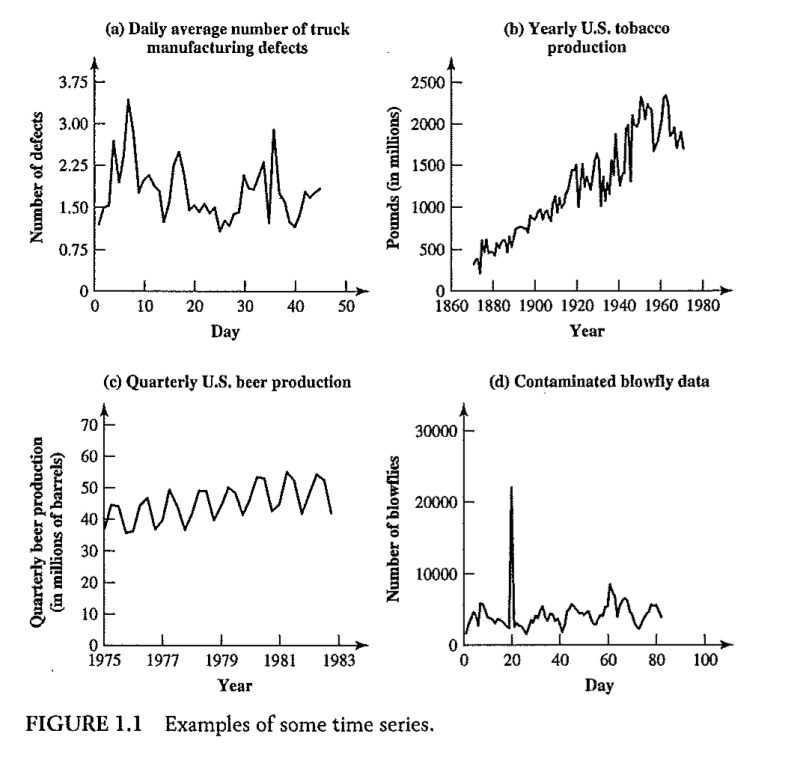
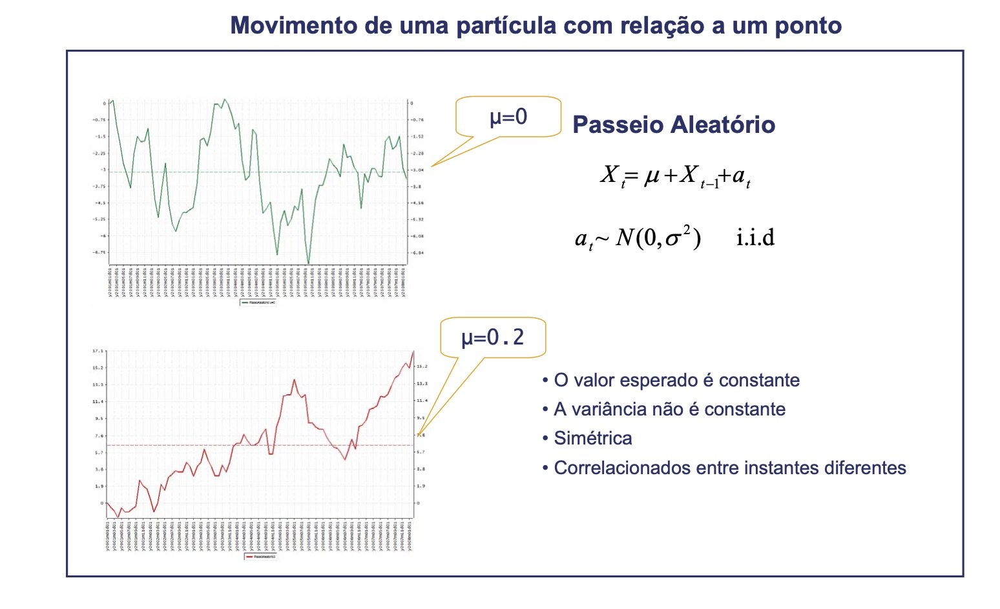
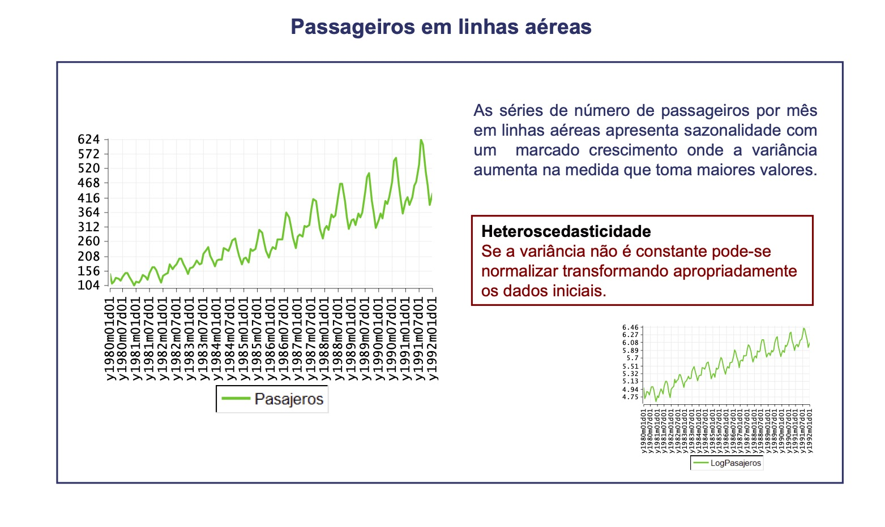

#Introdução

## O que é uma série temporal ?

Uma série temporal é um qualquer conjunto de observações ordenadas no tempo (Morettin & Toloi, 2004).
 
##Exemplos

1. Valores diários de poluição na cidade de São Paulo;
2. Valores mensais de temperatura na cidade de Cananéia;
3. Índices diários da Bolsa de Valores de São Paulo;
4. Precipitação atmosférica anual na cidade de Fortaleza;
5. Número médio anual de manchas solares;
6. Registro de marés no porto de Santos.


---
### Breve Histórico

- Os desenvolvimentos teóricos na análise de séries temporais começaram com **processos estocásticos**. 

- A primeira aplicação real de modelos autoregressivos aos dados pode ser trazida de volta ao trabalho de [Yule](https://en.wikipedia.org/wiki/Udny_Yule) e [Walker](https://en.wikipedia.org/wiki/Gilbert_Walker) nas décadas de 1920 e 1930.

- Durante esse período, a média móvel foi introduzida para remover flutuações periódicas nas séries temporais, por exemplo, flutuações devido à sazonalidade. 

- Herman [Wold](https://en.wikipedia.org/wiki/Herman_Wold) apresentou os modelos ARMA (AutoRegressive Moving Average) para séries estacionárias,

- Mas não conseguiu derivar uma função de verossimilhança para permitir a estimativa da máxima verossimilhança (ML) dos parâmetros.

- Isso aconteceu apenas na década de 1970. G. E. P. [Box](https://en.wikipedia.org/wiki/George_E._P._Box) e G. M. Jenkins publicaram o clássico "Análise de Séries Temporais", descrevendo o procedimento completo de modelagem para séries individuais: especificação, estimativa, diagnóstico e previsão.


---
### Breve Histórico

- Atualmente, os chamados modelos Box-Jenkins são talvez os mais usados e muitas técnicas utilizadas para previsão e ajuste sazonal podem ser rastreadas até esses modelos.

- A primeira generalização foi a aceitação de modelos ARMA multivariados, entre os quais os modelos VAR (Vector AutoRegressive) se tornaram populares. 

#### Modelos ARCH and GARCH 

- Outra linha de desenvolvimento em séries temporais, originárias dos modelos Box-Jenkins, são os modelos não lineares, ARCH (AutoRegressive Condicional Heteroscedasticity) - e GARCH.

- Esses modelos permitem parametrização e previsão de variância não constante. Esses modelos se mostraram muito úteis para séries temporais financeiras. 

- O desenvolvimento desses modelos e o de correção de erros deram a C. W. J [Granger](https://en.wikipedia.org/wiki/Clive_Granger) e R. F. [Engle](https://en.wikipedia.org/wiki/Robert_F._Engle) o Prêmio Nobel Memorial de Ciências Econômicas em 2003.

- Maiores detalhes podem ser vistos [em :](https://www.statistics.su.se/english/research/time-series-analysis/a-brief-history-of-time-series-analysis-1.259451#:~:text=Publications-,A%20brief%20history%20of%20time%20series%20analysis,started%20early%20with%20stochastic%20processes.&text=During%20this%20time%20the%20moving,example%20fluctuations%20due%20to%20seasonality.)

---
##Séries Temporais Discretas

Uma série temporal é discreta quando o conjunto de observações for tomado em tempos específicos, geralmente equiespaçados.

##Séries Temporais Contínuas
Uma série temporal é contínua  quando as observações são feitas continuamente no tempo.

##Algumas observações (Ehlers, 2008)

- Séries contínuas podem ser discretizadas se os valores são registrados a certos intervalos de tempo.
- Séries podem ser valores agregados ou acumulados em intervalos de tempo, exemplo, exportações medidas mensalmente ou quantidade de chuva medida diariamente.

---
#Exemplo

- Os exemplos 1 à 5 são séries temporais discretas, enquanto que o exemplo 6 é uma série temporal contínua.

- Observa-se que para analisar o exemplo 6, será necessário amostrá-la em um intervalo de tempo regular, convertendo a em uma série discreta.

- Em outros casos, como para as séries 4 ou 5, temos que o valor da série num dado instante é obtido acumulando-se (ou agregando-se) valores em intervalos de tempos iguais.

---
class: inverse, center, middle
#Gráficos de séries temporais

---
#Gráfico de série temporal

- Uma importante ferramenta em análise de séries temporais é o gráfico de séries temporais.

- Um gráfico de série temporal é um gráfico de dispersão com valores observados no eixo y e as datas correspondentes no eixo x.

---
#Exemplos de Gráficos de série temporal

a. Número médio diário de defeitos de fabricação de caminhões;

b. Produção anual de tabaco nos EUA;

c. Produção trimestral de cerveja nos EUA;

d. Número de moscas.
 

---
#Exemplos de Gráficos de série temporal


---
##Número médio diário de defeitos de fabricação de caminhões

- A série número médio diário de defeitos de fabricação de caminhões aparentemente 
varia em torno de um nível fixo (uma média).

- Séries que apresentam esse comportamento são ditas serem estacionárias na média.

##Produção anual de tabaco nos EUA

- Por outro lado, a série produção anual de tabaco nos EUA aparenta exibir uma tendência;

- Além disso, a variância cresce ao longo do tempo;

- Série não estacionária.

---
##Produção trimestral de cerveja nos EUA

- A série produção trimestral de cerveja nos EUA apresenta outra característica padrão que é repetitiva devido a variação sazonal.

- São chamadas de séries temporais sazonais.

##Número de moscas

- Nessa série a não estacionariade é devida uma mudança na estrutura da série devida a uma perturbação externa (Intervenção).
- Para esses casos, transformações nos dados não resolverá o problema.


---
class: inverse, center, middle
#Alguns conceitos iniciais

---
## Tendência 

-  Uma mudança a longo prazo no nível da série. Crescimento ou descrescimento.

## Sazonalidade 

- Comportamento da série temporal tende a se repetir a cada $s$ períodos de tempo.

### Diferença entre padrões sazonais e cíclicos (Rob J. Hyndman)

-  Padrões sazonais tem comprimento constante enquanto que padrões cíclicos tem comprimentos variáveis;

-  O comprimento médio dos ciclos são mais longos do que padrões sazonais;

- Magnitude do ciclo é mais variável do que a do sazonal

[Rob](https://robjhyndman.com/)


---
#Depedência em Séries Temporais  (Nicoleta Serban)

- Séries Temporais implica em dependência, portanto, o número de graus de liberdade
é menor do que o número observado.

- Amostragem dos dados: $Y_t, t = 1, \ldots, T$, concentrado em uma pequena parte 
do espaço de probabilidade

##Ignorar dependência resulta em

- Erros padrões irrealísticamente pequenos e, consequentemente,
intervalos de confiança exageradamente estreitos.

Referência: [Nicoleta](https://www.youtube.com/watch?v=VTarwTHQWVk&list=PL_onPhFCkVQghJC-KQkUNvkAGbriARyfX&index=2)

---
class: inverse, center, middle
#Outros exemplos - Victor Hugo D'Avila

---


---


---


---


---


---


---
class: inverse, center, middle
#Dados Simulados


---
##Exemplo 1 - Processo Auto-regressivo de ordem 1

```{r, eval = FALSE, warning  = FALSE, message = FALSE }

ar1.sim = arima.sim(list(order = c(1,0,0), ar = 0.7), n =500)
ts.plot(ar1.sim)

```


---
##Exemplo 1 - Processo Auto-regressivo de ordem 1

```{r, echo = FALSE, warning  = FALSE, message = FALSE }
ar1.sim = arima.sim(list(order = c(1,0,0), ar = 0.7), n =500)
ts.plot(ar1.sim)

```


---
##Exemplo 2 - Processo ARIMA (1,1,0)

```{r, eval = FALSE, warning  = FALSE, message = FALSE }
arima110.sim <- arima.sim(list(order = c(1,1,0), ar = 0.7), n =500)

#Plotando a série original
ts.plot(arima110.sim)

#Plotando a série com 1 diferença
ts.plot(diff(arima110.sim, differences=1))


```

---
##Exemplo 2 - Processo ARIMA (1,1,0) 

```{r, echo = FALSE, warning  = FALSE, message = FALSE }
arima110.sim <- arima.sim(list(order = c(1,1,0), ar = 0.7), n =500)
ts.plot(arima110.sim)

```

---
##Exemplo 2 Processo ARIMA (1,1,0) - Série com uma diferença 


```{r, echo = FALSE, warning  = FALSE, message = FALSE }
arima110.sim <- arima.sim(list(order = c(1,1,0), ar = 0.7), n =500)
ts.plot(diff(arima110.sim, differences=1))

```

---
##Exemplo 3 - Passeio aleatório

```{r, eval = FALSE, warning  = FALSE, message = FALSE }
rw.sim <- arima.sim(list(order = c(0,1,0)), n =500)
#Plotando a série original
ts.plot(rw.sim)

#Plotando a série com uma única diferença
ts.plot(diff(rw.sim, differences=1))


```

---
##Exemplo 3 - Passeio aleatório

```{r, echo = FALSE, warning  = FALSE, message = FALSE }
rw.sim <- arima.sim(list(order = c(0,1,0)), n =50000)

#Plotando a série original
ts.plot(rw.sim)

```


---
##Exemplo 3 - Passeio aleatório - Série com uma única diferença

```{r, echo = FALSE, warning  = FALSE, message = FALSE }
#Plotando a série com uma única diferença
ts.plot(diff(rw.sim, differences=1))

```

