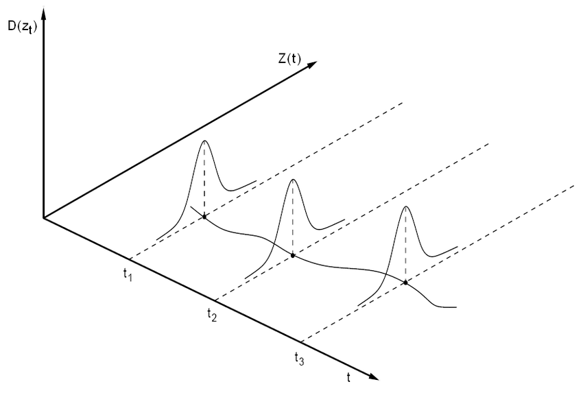
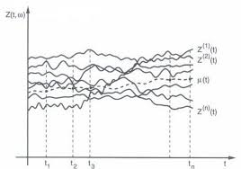

class: inverse, center, middle
#Processo Estocástico

---

##Processo estocástico interpretado como uma família de variáveis aleatórias (Morettin & Toloi, 2004, p. 22) 

---

##Processo estocástico interpretado como uma família de trajetórias (Morettin & Toloi, 2004, p. 23) 

---
#Processo Estocástico

##Definição:

* Seja $T$ um conjunto arbitrário. Um **processo estocástico** é uma família  
$Z = \left\{ Z(t), t \in T \right\}$, tal que, para cada $t \in T, Z(t)$ é uma variável aleatória.

* Nestas condições, um processo estocástico é uma família de variáveis aleatórias que suporemos definidas num espaço de probabilidades $\left(\Omega, \mathcal{F}, \mathcal{P} \right)$, em que $\Omega$ é o espaço amostral, $\mathcal{F}$ é uma classe de eventos aleatórios e $\mathcal{P}$ é uma probabilidade.

---
#Processo Estocástico

* Nós vamos assumir que o conjunto $T$ é tomado como o conjunto dos inteiros $\mathbb{Z}$.

* Ainda, para cada $t \in T, Z(t)$ será uma v.a. real.

* Como para cada $t \in T, Z(t)$ é uma v.a. definida sobre $\Omega$, na realidade $Z(t)$ é uma função de dois argumentos, $Z(t, \omega)$, $t \in T$, $\omega \in \Omega$.

* Por outro lado, para cada $\omega \in \Omega$ fixado, obteremos uma função de t, ou seja, uma **realização** ou trajetória do processo, ou ainda, uma **série temporal**.

* O conjunto de todas essas trajetórias é chamado de **"ensemble"**.

---
#Especificação de um processo estocástico

Sejam $t_1, t_2, \ldots, t_n$ elementos quaisquer de $T$ e consideremos

$F(z_1, \ldots, z_n; t_1, \ldots, t_n) = P(Z(t_1) \leq z_1, \ldots, Z(t_n) \leq z_n).$

Então, o processo estcocástico $Z = \left\{Z(t), t \in T \right\}$ estará especificado se conhecermos as **distribuições finito-dimensionais**, para todo $n \geq 1$.

Isto significa que:

* Para $n=1$, nós conhecemos as distribuições unidimensionais da v.a $Z(t_1), t \in T$
* Para $n=2$, nós conhecemos as distribuições bidimensionais da v.a $(Z(t_1), Z(t_2)), t_1, t_2 \in T$, e assim por diante.

Contudo, em termos práticos, não conhecemos todas essas distribuições finito dimensionais. O que se faz, no entanto, é estudar momentos de baixa ordem.

---
##Função média

$$\mu(t) = E[Z(t)] = \int_{-\infty}^{\infty}z f(t) dz$$

##Função de autocovariância
$$\gamma(t_1, t_2) = E[Z(t_1)Z(t_2)] - E[Z(t_1)]E[Z(t_2)], \phantom{111} t_1, t_2, \in T.$$

Observe que $\mu(t)$ é uma função de $t \in T$ e que $\gamma(t_1,t_2)$ depende de dois argumentos, $t_1$ e $t_2$. Em particular, se $t_1 = t_2 = t$, nos dá.

$$\gamma(t, t) = E[Z(t)^2] - E[Z(t)]^2 = Var[Z(t)],$$
---

class: inverse, center, middle
#Processos Estocionários

---
#Processos estacionários

* Intuitivamente, um processo $Z$ é estacionário se ele se desenvolve no tempo de modo que a escolha de uma origem dos tempos não é importante.

* Em outras palavras, as características de $Z(t + \tau)$ para todo $\tau$, são as mesmas de $Z(t)$.

##Definição 
Um processo estocástico $Z = \left\{ Z(t), t \in T \right\}$ diz-se **estritamente estacionário** se todas as distribuições finito-dimensionais permanecem as mesmas sob translações no tempo, ou seja,

$$F(z_1, \ldots, z_n; t_1 + \tau, \ldots, t_n + \tau) = F(z_1, \ldots, z_n; t_1, \ldots, t_n),$$
para quaisquer $t_1, \ldots t_n$ de $T$.

---
#Processos estacionários de segunda ordem

##Definição

Um processo estocástico $Z = \left\{Z(t), t \in T \right\}$ diz-se fracamente estacionário ou estacionário de segunda ordem (ou em sentido amplo) se e somente se

1.  $E[Z(t)] = \mu_t = \mu,$ para constante, para todo $T$;
2.  $E[Z^2(t)] < \infty$ para todo $t \in T$;
3.  $\gamma(t_1, t_2) = Cov[Z(t_1), Z(t_2)]$ é uma função de $|t_1 - t_2|$.

Note que se $Z$ for estritamente estacionário, ele não necessitará ser francamente estacionário, pois a condição 2 pode não estar satisfeita.

---
#Processos Gaussianos

##Definição

Um processo estocástico $Z = \left\{Z(t), t \in T \right\}$ diz-se **Gaussiano** se, para qualquer conjunto $t_1, t_2, \ldots, t_n$ de $T$, as v.a. $Z(t_1), \ldots, Z(t_n)$ tem distribuição normal $n$-variada.

* Se um processo for Gaussiano ele será determinado pelas médias e covariâncias; em particular, se ele for estacionário de segunda ordem, ele será estritamente estacionário. 

* A prova desse resultado é um dos exercícios da lista para entregar no final do semestre

---
class: inverse, center, middle
#Exemplos

---
class: middle
##Sequências de Variáveis Aleatórias

 - Considere $\left\{X_n, n = 1, 2, \ldots  \right\}$ uma sequência de v.a definidas no mesmo espaço amostral $\Omega.$
 
 - Para todo $n \geq 1,$ podemos escrever
 
\begin{align}
&P\left(X_1 = a_1, \ldots, X_n = a_n \right) = P\left(X_1 = a_1 \right) P(X_2 = a_2| X_1 = a_1) \times \ldots \times \\
&P\left(X_n = a_n| X_1 = a_1, \ldots, X_{n-1} = a_{n-1}\right)
\end{align}

- $a_j's$ representam estados do processo e o espaço dos estados pode ser tomado como o conjunto dos reais.

---
class: middle
##Sequências de Variáveis Aleatórias Mutuamente Independentes e Identicamente Distribuídas

- As v.a $X_1, \ldots X_n$ têm todas a mesma distribuição. Ainda, temos:

$$P\left(X_1 = a_1, \ldots, X_n = a_n \right) = P(X_1 = a_1) \ldots P(X_n = a_n).$$

- Nesse caso, o processo é estritamente estacionário.

- Se $E[X_n] = \mu,$ $Var[X_n] = \sigma^2,$ para todo $n \geq 1$, então
$Cov(X_n, X_{n +\tau}) = \sigma^2,$ se $\tau = 0$ e $Cov(X_n, X_{n +\tau}) = 0$ caso contrário.

---
class: middle
##Ruído Branco

Dizemos que $\left\{ \epsilon_t, t \in \mathcal{Z}\right\}$ é um *ruído branco discreto* se as v.a $\epsilon_t$ são não correlacionadas, isto é, $Cov\left\{ \epsilon_t, \epsilon_s \right\} = 0, t \neq s.$

Tal processo será **estacionário** se $E[\epsilon_t] = \mu_{\epsilon}$ e $Var[\epsilon_t] = \sigma^2_{\epsilon},$ para todo $t$. Segue-se 

\begin{eqnarray}
Cov[\epsilon_t, \epsilon_s] = \left\{
\begin{array}{cc}
\sigma^2, & \mbox{se}\phantom{11} \tau = 0  \\
0, & \mbox{se} \phantom{11} \tau \neq 0. \end{array} \right. 
\end{eqnarray}

---
#Revisão de Propriedades de Covarâncias

1. $Cov(aX + b, cY + d) = acCov(X,Y)$

2. $Cov(X_1 + X_2, Y) = Cov(X_1,Y) + Cov(X_2, Y),$

3. $Cov(X,X) = Var(X),$

4. $Var(X + Y) = Var(X) + Var(Y) + 2Cov(X,Y).$    

5. Se $X$ e $Y$ são independentes, então $Cov(X,Y) = 0$.

Detalhes das provas podem ser vistos [aqui](https://ocw.mit.edu/courses/mathematics/18-05-introduction-to-probability-and-statistics-spring-2014/readings/MIT18_05S14_Reading7b.pdf)

---
##Valor esperado do Passeio Aleatório

Considere o seguinte modelo

$$X_t = X_{t-1} + \epsilon_t,$$ 
em que $\epsilon_t$ é um ruído branco $i.i.d(\mu_{\epsilon},\sigma^2_{\epsilon})$. Vamos assumir uma condição inicial $X_0 = 0.$

\begin{align}
X_1 =& X_0 + \epsilon_1 \\
X_2 =& X_1 + \epsilon_2 = X_0 +\epsilon_1 +\epsilon_2 \\
X_3 =& X_2 + \epsilon_3 = X_0 +\epsilon_1 +\epsilon_2 +\epsilon_3 \\
& \vdots \\
X_t =& X_0 + \epsilon_1 + \ldots + \epsilon_{t} \\
X_t =& X_0 + \sum_{k=1}^t \epsilon_k.
\end{align}

Assim, 

\begin{align}
E[X_t] = E[X_0 + \sum_{k=1}^t \epsilon_k  ] = E[X_0] + E[\sum_{k=1}^t \epsilon_t] =  E[X_0] + \sum_{k=1}^t E[\epsilon_t] = t\mu_{\epsilon}.
\end{align}

---
##Variância  do Passeio Aleatório

\begin{align}
Var[X_t] = Var[X_0 + \sum_{k=1}^t \epsilon_k  ] =  Var[\sum_{k=1}^t \epsilon_t] =  t\sigma^2_{\epsilon}.
\end{align}

##Covariância  do Passeio Aleatório

\begin{align}
Cov[X_{t_1}, X_{t_2}] =& Cov[X_0 + \sum_{k=1}^{t_{1}} \epsilon_k, X_0 + \sum_{k=1}^{t_{2}} \epsilon_k  ] \\
&=  Cov[ \sum_{k=1}^{t_{1}} \epsilon_k,  \sum_{k=1}^{t_{2}} \epsilon_k  ] \\
&= \sum_{k=1}^{\mbox{min}(t_{1},t_{2})}Cov[\epsilon_t] \\
&= \mbox{min}(t_{1},t_{2})\sigma^2.
\end{align}
